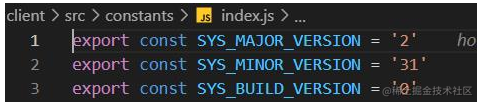
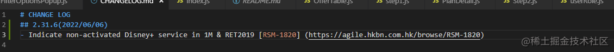
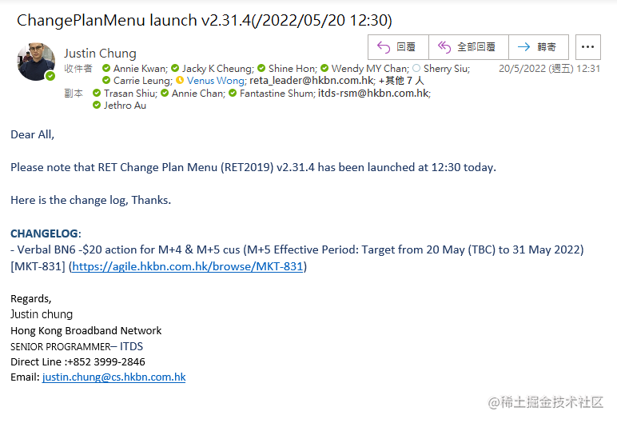
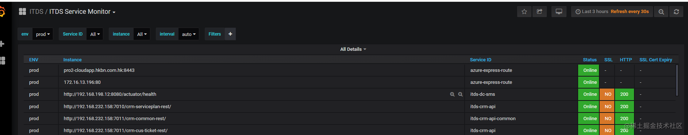
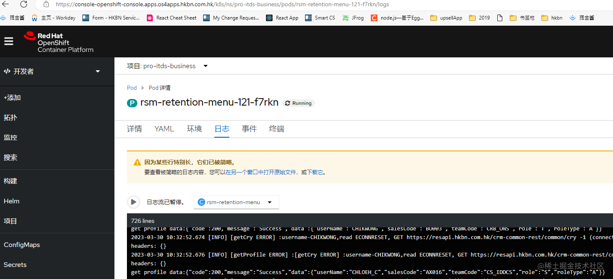

# 新地址

https://uat-business.osapps.hkbn.com.hk/rsm-retention-menu-uat?pps=712092653
https://gitscm.hkbn.com.hk/retention-revamp/changeplanmenu-main


項目git地址 https://gitscm.hkbn.com.hk/RES-Sales-App/rsm-retention-menu

舊地址
測試：http://resuat.hkbn.com.hk/changeplanmenuweb?pps=738200100
生產：http://res.hkbn.com.hk/changeplanmenuweb/?pps=738200100
jenkins(舊地址): http://uatjenkins.hkbn.com.hk:8080/       (密碼微軟賬號密碼)

新地址
測試：https://uat-business.osapps.hkbn.com.hk/rsm-retention-menu-uat?pps=738200100
生產：https://business.osapps.hkbn.com.hk/rsm-retention-menu?pps=737280208


賬號一定要登錄這個 不然沒有
anniek_c M1nipack423
BA600 GOU01


# 合并到uat要看看Jenkins 有沒有重新build:
http://jenkinsmaster.hkbn.com.hk:8080/job/ITDS/job/business/job/uat/job/rsm-retention-menu/


UAT: gitlab->merge to uat -> trigger jenkins-> npm install->tag docker image->upload jfrog-> openshift deploy

Prd: gitlab->merge to master -> trigger jenkins-> create SR form->approved->trigger jenkins->npm install->tag docker image->upload jfrog-> openshift deploy

# 日常穩pps可以用oracle
> 賬號/密碼:hkbn/bn1506hk
語句:``SELECT * FROM RET_SERV_LIST WHERE HAS_FUTURE = 'N' AND SERVICE_TYPE = 'AS'``


# 上live過程:
#### 1.先在新場起一個bump-version-2.XX.X 的branch
#### 2.把你的branch merge入去
#### 3.update 兩個文件:

- a.client/src/constants/index.js    下面

          export const SYS_MAJOR_VERSION = '2'
          export const SYS_MINOR_VERSION = '31'
          export const SYS_BUILD_VERSION = '3'



- b.client/CHANGELOG.md



  ```
  ## 2.31.3(2022/05/19)
- Allow RET menu Control Earliest Start Bill date of MS Plan [RSOD-3113] (https://agile.hkbn.com.hk/browse/RSOD-3113)
- hotfix: [Ref#E2205036CS] - Submit incorrect AS service code when PPS exists multiple adrress [RSM-1811] (https://agile.hkbn.com.hk/browse/RSM-1811)
```
第一個文件, 系改版本號
第二個文件, 系寫翻change log, 好似上一個版本 2.31.0 甘加入去
然后 commit 同 push,完成了本地merge
#### 4. https://gitscm.hkbn.com.hk/RES-Sales-App/rsm-retention-menu/merge_requests
提交merge request
同意后
#### 5.https://elite.hkbn.com.hk/hkbn?id=form&table=change_request&sys_id=2b098caadbdf8154c8649c6dd3961977&view=sp
參考模板填寫form
https://elite.hkbn.com.hk/hkbn?id=hkbn_my_change_requests


#### 6.發郵件公佈



# check log

http://192.168.233.145:5601/login?next=%2Fapp%2Fkibana#/discover/051353b0-e39f-11eb-af2b-eb1ba37003cf?_g=(filters:!(),refreshInterval:(pause:!t,value:0),time:(from:'2022-03-31T23:00:00.000Z',to:'2022-04-26T12:00:00.000Z'))&_a=(columns:!(message,env,application),filters:!(('$state':(store:appState),meta:(alias:!n,disabled:!f,index:aada33a0-5a37-11eb-8fb8-6182907d43a8,key:env,negate:!f,params:(query:prod),type:phrase),query:(match_phrase:(env:prod))),('$state':(store:appState),meta:(alias:!n,disabled:!f,index:a3fe1bf0-c4e0-11eb-857a-5df95b68fe4b,key:application,negate:!f,params:(query:rsm-retention-middleware),type:phrase),query:(match_phrase:(application:rsm-retention-middleware)))),index:a3fe1bf0-c4e0-11eb-857a-5df95b68fe4b,interval:auto,query:(language:kuery,query:'770418418'),sort:!(!('@timestamp',desc)))

賬號/密碼: itds / KWNYrX5sCt_z


# 查看api有沒問題
https://grafana.hkbn.com.hk/d/SBaNOYz7k/itds-service-monitor?orgId=1&refresh=30s ```賬號/密碼 :itds-viewer/ssVxRGBZ3lyqt8N63V8s```




# 睇log
[rsm-retention-menu-121-f7rkn · Details · Red Hat OpenShift Container Platform (hkbn.com.hk)](https://console-openshift-console.apps.os4apps.hkbn.com.hk/k8s/ns/pro-itds-business/pods/rsm-retention-menu-121-f7rkn/logs)
```
production
賬號:pro-itds-business-view
密碼:EkbauNvzDUw0TTh9HgJL
```
```
uat
賬號:uat-itds-business-admin
密碼:YqPQvN0YzrlqmFXE5E4a
```


