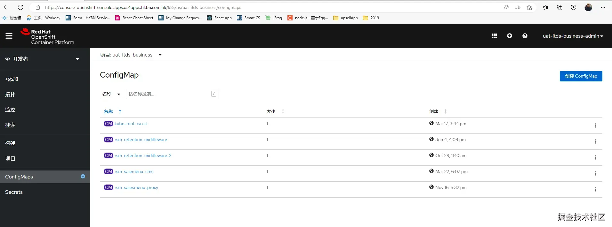
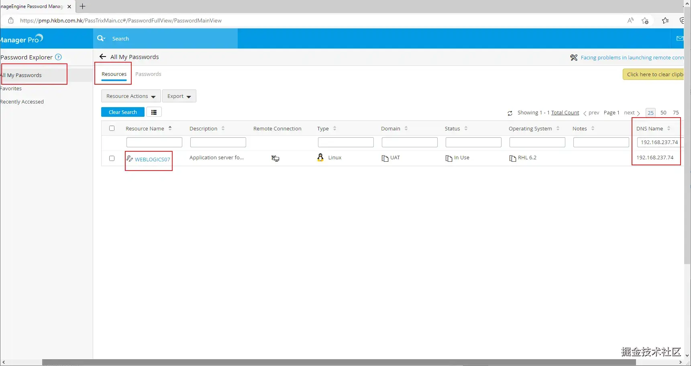
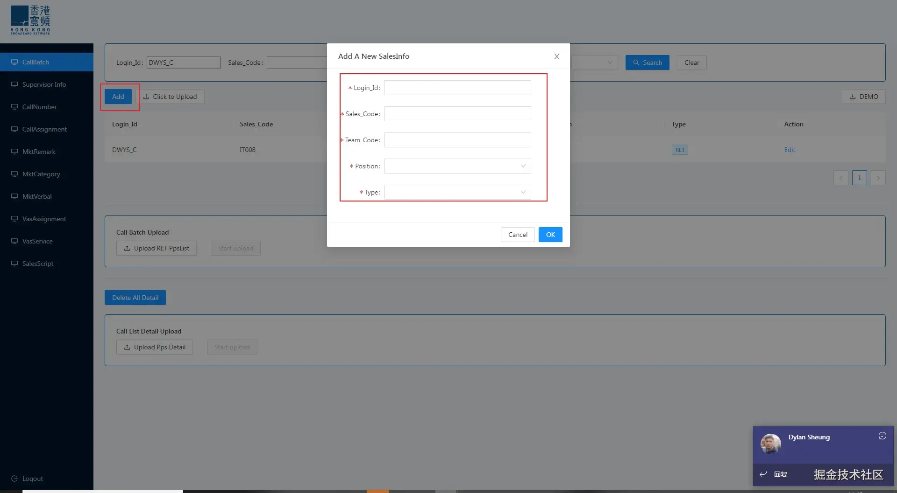
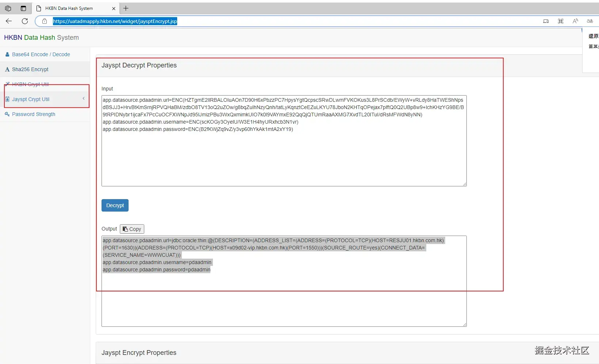

# jira是日常看需求以及填報工作安排:https://agi

https://agile.hkbn.com.hk/secure/Tempo.jspa#/resource-planning?from=2022-05-01&periodType=CURRENT_MONTH&to=2022-06-04&worker=JIRAUSER43410


郵箱justin.chung@cs.hkbn.com.hk

### 遠程辦公

Link ：[https://gzrdsr.hkbn.net.cn](https://apc01.safelinks.protection.outlook.com/?url=https%3A%2F%2Fgzrdsr.hkbn.net.cn%2F&data=05%7C01%7Cjustin.chung%40cs.hkbn.com.hk%7C42ab5d73e4a8486d54f108da326014c4%7Cb098cc1aaaa5436a8fc133a51cef2d55%7C0%7C0%7C637877685619557692%7CUnknown%7CTWFpbGZsb3d8eyJWIjoiMC4wLjAwMDAiLCJQIjoiV2luMzIiLCJBTiI6Ik1haWwiLCJXVCI6Mn0%3D%7C3000%7C%7C%7C&sdata=NqOgY8OnPEQ4xOspoolCITtuPMGkCzEIMrkZFNsehHQ%3D&reserved=0)

>第一步：login: remote.justin.chung   /   N)x+u7CV5Qq_


>链接成功后,输入justin.chung /Aa86175310202301
进入跳板机后,在远程链接192.168.212.90 这个ip
>然后输入开机密码 justin.chung /Aa86175310202301

HKRDS account: justin.chung.rds
Mobile MDM: <justin.chung@cs.hkbn.com.hk>

### HKRDS
IP地址：192.168.170.176
用户名：justin.chung.rds
密码：Aa86175310202301

提交生產環境,提交form地址:https://elite.hkbn.com.hk/hkbn?id=hkbn_my_change_requests


公司win机帐号:justin.chung@cs.hkbn.com.hk
密码: Aa86175310202301


公司chris Mac機密码:Sep2021zwc


公司gitleb个人账号:justin.chung@cs.hkbn.com.hk
密码:a86175310

### 查看工資單:https://esappl.hkbn.com.hk:4443/forms/frmservlet?config=hr_gz
```
登錄進去賬號密碼
userName:KCC_C
password:ABC1234
database：HR

查看個人工資
loginID:KCC_C
員工編號:ZC220095
P/W：Aa86175310202301
```


# UAT openshift 睇log
:https://console-openshift-console.apps.os4apps.hkbn.com.hk/k8s/ns/uat-itds-business/pods/rsm-retention-menu-uat-2-15-rq5bx/logs
賬號:uat-itds-business-admin 密碼:YqPQvN0YzrlqmFXE5E4a



日常穩pps可以用oracle
賬號/密碼:hkbn/bn1506hk
語句:SELECT * FROM RET_SERV_LIST WHERE HAS_FUTURE = 'N' AND SERVICE_TYPE = 'AS'


https://dynatrace.hkbn.com.hk/e/249903c4-3ad1-4d3b-a482-adec634bb5fc/#vres;pid=-1652712934074603206_1657798860000V2;gf=all
查看服務器哪裡出問題

`itds/pass1234`

# Rancher 地址
https://rancher.hkbn.com.hk/dashboard/c/c-m-wpvn68k8/explorer/apps.deployment


# 查看 server密碼https://pmp.hkbn.com.hk/PassTrixMain.cc#/PasswordFullView/PasswordMainView
賬號justin.chung 密碼Aa86175310202301

# 創建2019登錄賬號
https://uat-business.osapps.hkbn.com.hk/salemenu-cms/#/CallBatch



# OCEAN
https://res.hkbn.com.hk/
https://resuat.hkbn.com.hk/

# 解密
鏈接RDS再打開
[HKBN Data Hash System](https://uatadmapply.hkbn.net/widget/jaysptEncrypt.jsp)
User/PW: uatact/111111



# Remote Mac
安全密码:Aa86175310#


login in id 係個Key存在下面
```
secu_user_profile
```
role 顯示有咩權限種類,定義role係做咩
```
secu_role_profile
```
將login in id 跟role 配對,告訴這個login in id 地下有哪些role
```
secu_user_role_map
```